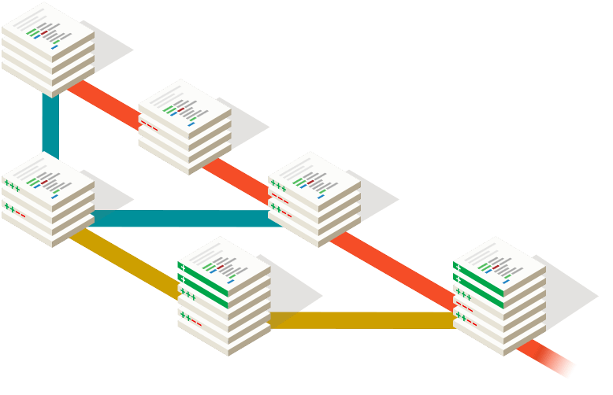

# The Innovation flow

This is an abstract idea of the Git workflow we're following in the Innovation
team, it covers from the structure of our commit messages to the branching model
we're using.

## Commit messages

In order to give more context to our pull requests and to have a beautiful and
useful `git tree` we should add useful `commit` messages to our `pull requests`.

The commit template we're using is this:

```
# Some awesome title

# This question tells reviewers of your pull request what to expect in the
# commit, allowing them to more easily identify and point out unrelated changes.
1. Why is this change necessary?

# Describe, at a high level, what was done to affect change.
2. How does it address the issue?

# This is the most important question to answer, as it can point out problems
# where you are making too many changes in one commit or branch.
3. What side effects does this change have?
```

The commit title must be 50 characters or less, the body must be 80 characters
or less and the title must start with the type of auxiliary branch used for the
integration, for example:

    feature: Implement GPG key ring to sing requests

Consider making including a link to the issue/story/card in the commit message
as the first paragraph after the summary a standard for your project. Full urls
are more useful than issue numbers, as they are more permanent and avoid
confusion over which issue tracker it references.

Starting with this structure forces you to answer why the change is necessary
before outlining the changes that you have made towards this goal.



###### Automate it!

Save the commit template inside a file named `~/.gitmessage`.
Then add the following lines to your `~/.gitconfig`:

```
[commit]
  template = ~/.gitmessage
```

## Branches

Our branching model is based on the efficient branching model
[git-flow](https://danielkummer.github.io/git-flow-cheatsheet/) but has some
minor changes to simplify things.

### Master and Develop branches

Our worflow has two main branches, `develop` and `master`.

The `master` branch stores the official release history.
The `develop` branch is used to integrate new features.

The constraints for using these branches are the following.:

1. Only Tony can merge into to `master`.
2. No one can push directly to `master` unless it's a `hotfix`.

Once `develop` has enough features and is ready to be integrated into
`master` a release should be created by using an `annotated tag` and it must be
named after a [star](https://www.naic.edu/~gibson/starnames/starnames.html) like
this:

1. git tag -a 1.2.3 -m "Aquarius"
2. git checkout master
3. git rebase development
4. git push origin master --follow-tags

*Suggestion:*
Automate the follow of tags with this command:

    git config --global push.followTags true


### Feature and fix branches

Each new feature must have its own branch which can be pushed to the central
repository for collaboration or backup without modifying `develop` or
`master`.

All feature branches are created from `develop` and when a `feature` or `fix` is
finished it must be `rebased + merged` into `development. Features should
**never** interact with master directly.

The steps for creating a new `feature` or `fix` branch are the following:

1. `git checkout develop`
2. `git pull origin develop`
3. `git checkout -b "feature/my-feature"`

Once a `feature` or `fix` are completed and ready to be integrated into
`develop` its commits must be `rebased` (in case there's more the branch has
more than 1 commit) and `amended` so the branch has only 1 `commit` and the
message uses the template provided above. It's also important to rebase from
the latest version of `develop` and add a lightweight tag to the commit.`

Then, we follow this process:

1. `git fetch`
2. `git rebase origin/develop`
3. `git tag <semmantic versioning>`
3. `git push origin feature/my-feature`

Once a branch has been integrated into `develop` it must be deleted from the
remote server.


### Hotfix

A hotfix is a very special case where we need to create a new branch from
`master` and integrate it directly into `master`.

This should be the last resource we use and the only case where we should do
this is when we have a terrible bug in production that needs to be fixed
**urgently**, if that's not the case, create a fix.

The process is similar to that of a `fix` branch but we need to add these steps
after it was integrated:

*From your `master` branch:*

1. git checkout develop
2. git rebase master

---

## Simplify the way you use git with these Zsh plugins:

The [git](https://github.com/robbyrussell/oh-my-zsh/tree/master/plugins/git)
plugin provides many aliases and a few useful functions.

The
[gitfast](https://github.com/robbyrussell/oh-my-zsh/tree/master/plugins/gitfast)
This plugin adds completion for Git, using the zsh completion from git.git folks
, which is much faster than the official one from zsh.

Add a cool theme that shows you the current state of git, like mine:

